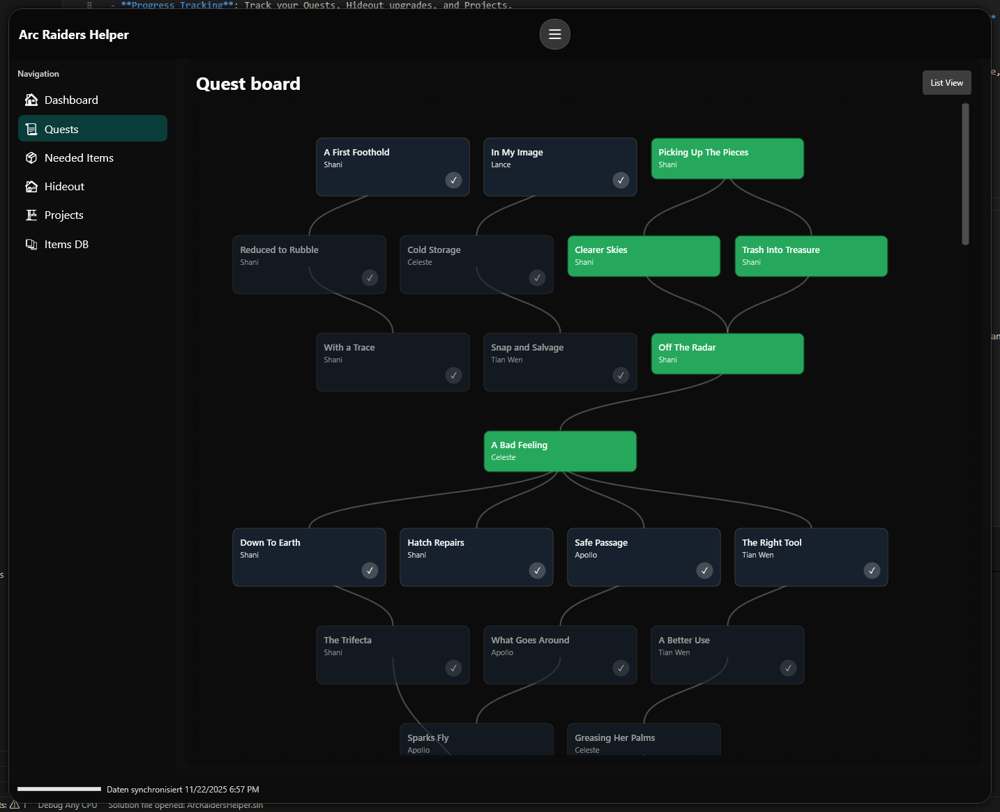
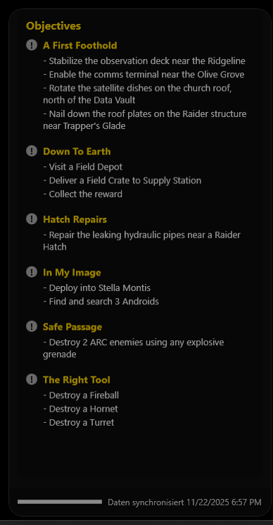
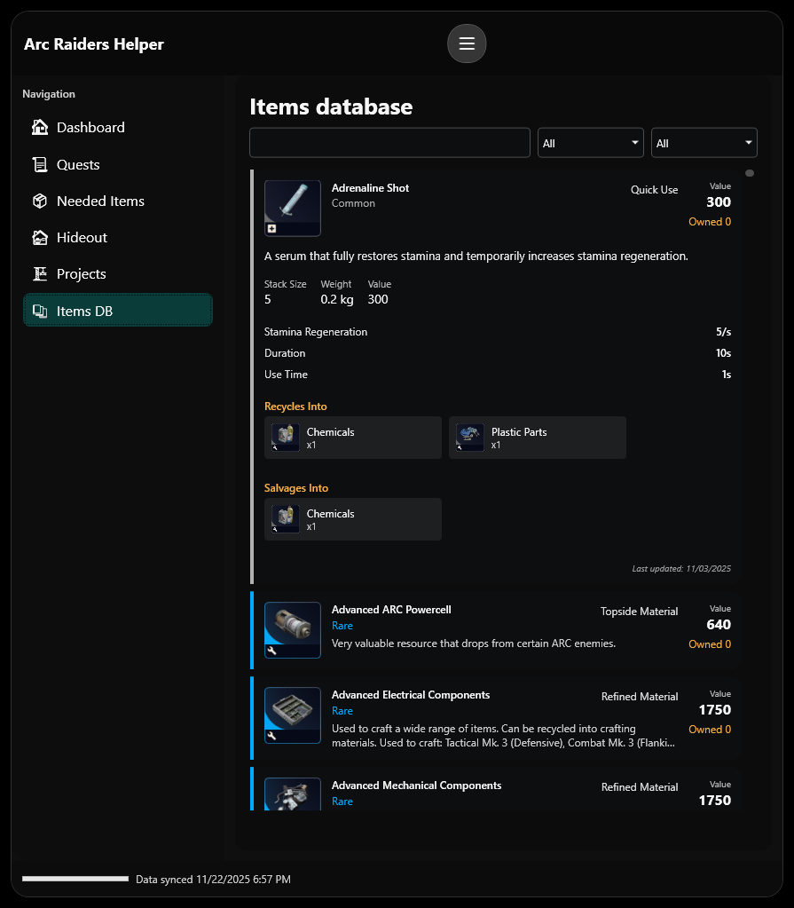

# Arc Raiders Overlay Helper

A lightweight, native WPF overlay for Arc Raiders that helps you track your progress, quests, and needed items directly over the game.


## Features

- **Native Overlay**: A high-performance, always-on-top overlay that blends seamlessly with your game.
- **Progress Tracking**: Track your Quests, Hideout upgrades, and Projects.
  - **Automatic tracking**: All these plus needed items can be automatically tracked. This feature is still experimental and was only tested on **Borderless Window** and **2560x1440 resolution**!
- **Needed Items**: Quickly see what items you need to collect for your active goals.
- **Interactive & Click-through**:
  - **Interactive Mode**: Browse data, manage settings, and check your progress.
  - **Click-through Mode**: Toggle (`Ctrl+Alt+T`) to make the overlay transparent to mouse clicks, allowing you to play while keeping your data visible. In this mode, the navigation bar is hidden to minimize screen real estate.
- **Customizable**:
  - Adjust opacity for both interactive and click-through modes.
  - Toggle "Always on Top".
  - Configurable global hotkeys.
  - Window position and size persistence.
- **Auto-Updates**: Automatically checks for and installs the latest version on startup.

### Quest View

Visualize your journey through the Arc Raiders questlines with two powerful viewing modes.

**Quest Tree**
The interactive tree view maps out quest dependencies, allowing you to see exactly what needs to be done to unlock future missions.
- **Visual Progression**: Clear lines connect quests to their prerequisites.
- **Status Tracking**: Color-coded cards indicate whether a quest is Completed (Green), active (non transparent) or locked (transparent).
- **Details**: Click any quest node to see objectives and rewards or click the checkmark to complete it.



**Quest Log**
If click-through mode is activated on the quest view, the view will switch to a quest tracker mode like in World of Warcraft.



### Items Database
Find specific items in an easy to use items database view.



## Data & Attribution

This project uses data provided by the community.

- **Data Source**: [RaidTheory/arcraiders-data](https://github.com/RaidTheory/arcraiders-data)
- **Inspired by**: [arctracker.io](https://arctracker.io)

All game content, including but not limited to game mechanics, items, names, and imagery, is copyright © Embark Studios AB. This repository is a community resource and is not affiliated with or endorsed by Embark Studios AB.

## Quick Start

1. Download the latest release.
2. Run `OverlayApp.exe`.
3. Use `Ctrl+Alt+O` to toggle the overlay visibility.
4. Use `Ctrl+Alt+T` to toggle click-through mode.

## Requirements

- Windows 10/11 (Build 19041 or newer)
- .NET 8 Desktop Runtime

## Development

```powershell
git clone https://github.com/Drommedhar/ArcRaidersHelper.git
cd ArcRaidersHelper
dotnet run --project OverlayApp
```

## License

This project is licensed under the MIT License - see the [LICENSE](LICENSE) file for details.
